# FSM 코드 관계 분석

## 1. 전체 구조

`FSM` 폴더는 계층형 상태 시스템으로 구성되어 있습니다.

- `@Base`는 상태 머신의 공통 계약과 열거형 정의를 제공합니다.
- `Agent`는 전투가 가능한 공용 에이전트 로직을 정의합니다.
- `GroundedAgent`는 `Agent`를 확장하여 지면 판정과 점프 동작을 추가합니다.
- `Player`와 `NPC`는 각 게임플레이 역할에 맞는 구체적인 상태 팩토리와 컨트롤러를 제공합니다.

런타임 흐름은 다음과 같습니다.

1. 입력, 애니메이션, 체력 이벤트가 핸들러 컴포넌트에서 수집됩니다.
2. 컨트롤러가 해당 이벤트를 현재 상태로 전달합니다.
3. 현재 상태가 유지, 전이, 또는 컨트롤러 동작 호출 여부를 결정합니다.
4. 일반 상태 머신은 현재 상태의 생명주기만 관리하고 게임플레이 규칙은 알지 않습니다.

## 2. 공통 기반 계층

### `@Base/StateMachine/StateMachine.cs`

- `StateMachine<T>`는 현재 상태를 저장하고 전이를 제어합니다.
- `ChangeState()`는 이전 상태의 `Exit()`를 호출한 뒤, 현재 상태를 교체하고, 새 상태의 `Enter()`를 호출합니다.
- `Operate()`는 매 프레임 현재 상태의 `Execute()`를 호출합니다.

### `@Base/StateMachine/IState.cs`

- `IState`는 공통 생명주기인 `Enter`, `Execute`, `Exit`를 정의합니다.
- `IAgentState`는 여기에 다음 기능을 확장합니다.
  - `FixedExecute()`
  - `OnAnimationEvent()`
  - `OnInputEvent()`
- `StateType`은 상태 조회용 딕셔너리의 공통 키입니다.

이 계층은 폴더 내 모든 컨트롤러의 기반이 됩니다.

## 3. Agent 계층

### `Agent/@Hub/AgentController.cs`

`AgentController`는 대부분의 게임플레이 에이전트를 조율하는 중심 클래스입니다.

이 클래스가 관리하는 항목은 다음과 같습니다.

- `AgentStatData`, `AgentMotorData` 같은 데이터 참조
- `AgentMotor2D`, `Health`, `AgentAnimator`, `AgentAnimationEventProxy` 같은 핵심 컴포넌트
- `AgentMovementHandler2D`, `AgentHealthHandler`, `AgentInputHandler` 같은 핸들러 객체
- `AgentStateMachine<IAgentState>` 상태 머신 인스턴스
- 상태 딕셔너리 `_states`

책임은 다음과 같습니다.

- `Awake()`에서 컴포넌트를 초기화합니다.
- 상태 머신을 생성하고 보관합니다.
- `Update()`에서 `Operate()`를 호출합니다.
- `FixedUpdate()`에서 `FixedOperate()`를 호출합니다.
- 애니메이션, 체력, 입력 이벤트를 현재 상태로 전달합니다.
- `Idle`, `Move`, `Attack`, `Hit`, `Death` 같은 액션 헬퍼를 제공합니다.

### `Agent/StateControl/AgentStateMachine.cs`

- `AgentStateMachine<T>`는 `StateMachine<T>`를 상속합니다.
- `FixedOperate()`를 추가해서 물리 기반 로직을 `FixedUpdate()`에서 실행할 수 있게 합니다.

### `Agent/StateControl/AgentStateBase.cs`

- `AgentStateBase<T>`는 `_agent`에 소유 컨트롤러를 저장합니다.
- 선택적 이벤트 훅에 대한 기본 no-op 구현을 제공합니다.
- 구체 상태는 이 베이스를 상속받아 컨트롤러 메서드에 직접 접근합니다.

### 공통 Agent 상태

- `IdleState`는 이동 시작 시 `Move`로 전이하고 공격 입력을 처리합니다.
- `MoveState`는 이동이 끝나면 `Idle`로 전이하고, `FixedExecute()`에서 이동을 수행합니다.
- `AttackState`는 공격 애니메이션을 재생하고, 타격 프레임 동작을 실행한 뒤 애니메이션 종료 후 `Idle`로 돌아갑니다.
- `HitState`는 피격 반응을 재생하고, 애니메이션 종료 후 `Idle`로 돌아갑니다.
- `DeathState`는 죽음 상태 진입 후 더 이상 행동하지 않습니다.

이 상태들은 몬스터와 플레이어 계열 모두에서 쓰이는 공통 전투 루프를 구성합니다.

## 4. GroundedAgent 확장

### `GroundedAgent/@Hub/GroundedAgentController.cs`

`GroundedAgentController`는 `AgentController`에 지면 및 점프 동작을 추가합니다.

추가되는 요소는 다음과 같습니다.

- 지면 판정을 위한 `GroundDetector`
- 점프 입력용 `IAgentJumpInput`
- 점프 이벤트 바인딩용 `GroundedAgentInputHandler`
- `Jump`, `Falling` 같은 점프 전용 액션 메서드

또한 `FixedUpdate()`에서 지면 상태를 먼저 갱신한 뒤 기본 물리 단계를 호출합니다.

### `GroundedAgent/StateControl/GroundedAgentStateBase.cs`

- `AgentStateBase`를 `GroundedAgentController`용으로 얇게 특화한 베이스입니다.
- 타입 제약을 단순화하는 용도로 존재합니다.

### Grounded 상태

- `GroundedIdleState`는 `IdleState`와 유사하지만, 지면 상태도 함께 확인합니다.
- `GroundedMoveState`는 `MoveState`와 유사하지만 공중 상태라면 `Fall`로 전환합니다.
- `JumpState`는 점프 타이밍과 애니메이션 종료 조건을 다루고, 이후 `Idle` 또는 `Fall`로 이동합니다.
- `FallState`는 공중에서 이동을 유지하고, 착지 후 `Idle` 또는 `Move`로 복귀합니다.

이 계층은 “무엇을 하는가”뿐 아니라 “지면에 있는가”라는 두 번째 축의 상태 로직을 추가합니다.

## 5. 구체 컨트롤러

### `Player/@Hub/PlayerController.cs`

- `PlayerController`는 `GroundedAgentController`를 상속합니다.
- `AgentImpactHandler`를 초기화하고 `PlayerStateFactory`를 통해 상태 딕셔너리를 생성합니다.
- 지면 공격 시 이동을 멈추도록 공격 동작을 재정의합니다.
- 공격 입력을 현재 상태로 전달합니다.

### `NPC/AIMonstor/@Hub/MonsterController.cs`

- `MonsterController`는 `AgentController`를 상속합니다.
- `MonsterStateFactory`를 통해 상태 딕셔너리를 생성합니다.
- 공격 입력을 현재 상태로 전달하지만, grounded 전용 동작은 추가하지 않습니다.

플레이어와 몬스터는 같은 기반 파이프라인을 공유하지만, 플레이어는 grounded 확장을 사용하고 몬스터는 더 단순한 Agent 계열을 사용합니다.

## 6. 상태 팩토리

### `Player/PlayerState/PlayerStateFactory.cs`

플레이어용 전체 grounded 상태 세트를 생성합니다.

- `Idle` -> `GroundedIdleState`
- `Move` -> `GroundedMoveState`
- `Jump` -> `JumpState`
- `Fall` -> `FallState`
- `Attack` -> `AttackState`
- `Hit` -> `HitState`
- `Death` -> `DeathState`

### `NPC/AIMonstor/MonsterState/MonsterStateFactory.cs`

몬스터용 단순 상태 세트를 생성합니다.

- `Idle` -> `IdleState`
- `Move` -> `MoveState`
- `Attack` -> `AttackState`
- `Hit` -> `HitState`
- `Death` -> `DeathState`

팩토리는 구체적인 상태 조합을 만드는 곳이며, 컨트롤러는 상태 딕셔너리 생성을 요청만 합니다.

## 7. 이벤트 라우팅

### 입력

- `AgentInputHandler`는 `IAgentCombatInput.AttackPressed`를 구독하고 컨트롤러의 `OnAttackAction()`을 호출합니다.
- `GroundedAgentInputHandler`는 `IAgentJumpInput.JumpPressed`를 구독하고 컨트롤러의 `OnJumpAction()`을 호출합니다.
- `PlayerInput`과 `AIPlayerInput`은 입력 인터페이스를 구현하고 reactive stream을 노출합니다.

### 체력

- `AgentHealthHandler`는 `Health.CurrentHealth`와 `Health.IsDead`를 감시합니다.
- 체력이 감소하면 컨트롤러의 `OnHit()`가 호출됩니다.
- 사망 상태 변화가 감지되면 `OnDeath()`가 호출됩니다.

### 애니메이션

- `AgentAnimationEventProxy`는 애니메이션 이벤트를 `OnAnimationEvent()` 호출로 변환합니다.
- `AttackState`, `HitState`, `JumpState` 같은 상태는 애니메이션 종료 신호를 이용해 전이를 마무리합니다.

### 전투

- `AgentCombatHandler`는 공격 프레임에 맞춰 히트 박스를 판정합니다.
- `AttackState`는 `OnAttackHitFrame()`을 호출하고, 이는 다시 `AgentCombatHandler.PerformAttack()`로 연결됩니다.

이 분리 구조 덕분에 컨트롤러는 이벤트 허브 역할만 맡고, 핸들러는 Unity 컴포넌트 바인딩을 분리해서 처리합니다.

## 8. 관계 요약

```mermaid
flowchart TD
    SM[StateMachine<T>] --> ASM[AgentStateMachine<T>]
    IState[IState / IAgentState] --> StateBase[AgentStateBase<T>]
    StateBase --> Idle[IdleState]
    StateBase --> Move[MoveState]
    StateBase --> Attack[AttackState]
    StateBase --> Hit[HitState]
    StateBase --> Death[DeathState]

    AgentController --> ASM
    AgentController --> HandlerInput[AgentInputHandler]
    AgentController --> HandlerHealth[AgentHealthHandler]
    AgentController --> HandlerAnim[AgentAnimationEventProxy]
    AgentController --> HandlerCombat[AgentCombatHandler]
    AgentController --> StatesDict[_states Dictionary]

    GroundedAgentController --> AgentController
    GroundedAgentController --> GroundHandler[GroundedAgentInputHandler]
    GroundedAgentController --> GroundStates[Jump / Fall / Grounded Idle / Grounded Move]

    PlayerController --> PlayerFactory[PlayerStateFactory]
    MonsterController --> MonsterFactory[MonsterStateFactory]

    PlayerFactory --> GroundedIdle[GroundedIdleState]
    PlayerFactory --> GroundedMove[GroundedMoveState]
    PlayerFactory --> JumpState
    PlayerFactory --> FallState
    PlayerFactory --> Attack
    PlayerFactory --> Hit
    PlayerFactory --> Death

    MonsterFactory --> Idle
    MonsterFactory --> Move
    MonsterFactory --> Attack
    MonsterFactory --> Hit
    MonsterFactory --> Death
```

## 9. 읽는 순서

이 시스템을 빠르게 이해하려면 다음 순서로 읽는 것이 좋습니다.

1. `@Base/StateMachine/IState.cs`
2. `@Base/StateMachine/StateMachine.cs`
3. `Agent/StateControl/AgentStateBase.cs`
4. `Agent/@Hub/AgentController.cs`
5. `Player/PlayerState/PlayerStateFactory.cs`
6. `GroundedAgent/@Hub/GroundedAgentController.cs`
7. `GroundedAgent/StateControl/States/*.cs`
8. `NPC/AIMonstor/MonsterState/MonsterStateFactory.cs`

이 순서는 기반 추상화에서 실제 게임플레이 동작으로 이어지는 의존 흐름과 일치합니다.